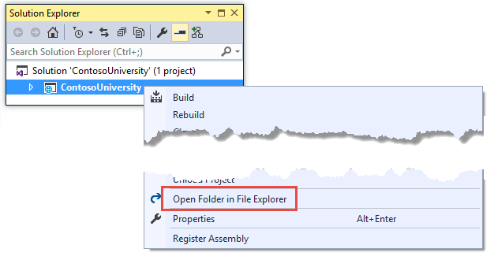
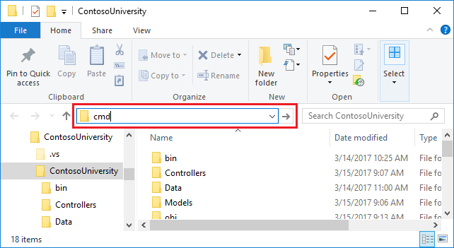
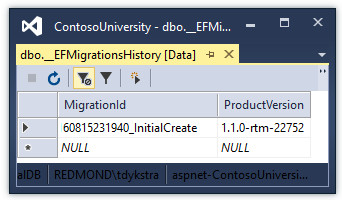

# Migrations - EF Core with ASP.NET Core MVC tutorial (4 of 10)

By [Tom Dykstra](https://github.com/tdykstra) and [Rick Anderson](https://twitter.com/RickAndMSFT)

The Contoso University sample web application demonstrates how to create ASP.NET Core 1.1 MVC web applications using Entity Framework Core 1.1 and Visual Studio 2017. For information about the tutorial series, see [the first tutorial in the series](intro.md).

In this tutorial, you start using the EF Core migrations feature for managing data model changes. In later tutorials, you'll add more migrations as you change the data model.

## Introduction to migrations

When you develop a new application, your data model changes frequently, and each time the model changes, it gets out of sync with the database. You started these tutorials by configuring the Entity Framework to create the database if it doesn't exist. Then each time you change the data model -- add, remove, or change entity classes or change your DbContext class -- you can delete the database and EF creates a new one that matches the model, and seeds it with test data.

This method of keeping the database in sync with the data model works well until you deploy the application to production. When the application is running in production it is usually storing data that you want to keep, and you don't want to lose everything each time you make a change such as adding a new column. The EF Core Migrations feature solves this problem by enabling EF to update the database schema instead of creating  a new database.

## Entity Framework Core NuGet packages for migrations

To add EF Core migrations support to a project, install packages for the EF Core tools.

* Install the design-time functionality for SQL Server, [Microsoft.EntityFrameworkCore.SqlServer.Design](https://www.nuget.org/packages/Microsoft.EntityFrameworkCore.SqlServer.Design). You can use the **Package Manager Console** or the **NuGet Package Manager** GUI to install this package.

  ```
  Install-Package Microsoft.EntityFrameworkCore.SqlServer.Design
  ```

  This automatically installs the dependency `Microsoft.EntityFrameworkCore.Relational.Design`. 

* Install the EF tools for the command-line interface (CLI): [Microsoft.EntityFrameworkCore.Tools.DotNet](https://www.nuget.org/packages/Microsoft.EntityFrameworkCore.Tools.DotNet). 

  To install this package, add it to the `DotNetCliToolReference` collection in the *.csproj* file, as shown. (The version numbers shown were current when the tutorial was written.)

  [!code-xml[](intro/samples/cu/ContosoUniversity.csproj?range=21-24&highlight=3)]
  
  (You can edit the *.csproj* file by right-clicking the project name in **Solution Explorer** and selecting **Edit ContosoUniversity.csproj**.)

## Change the connection string

In the *appsettings.json* file, change the name of the database in the connection string to ContosoUniversity2 or some other name that you haven't used on the computer you're using.

[!code-json[Main](intro/samples/cu/appsettings2.json?range=1-4)]

This change sets up the project so that the first migration will create a new database. This isn't required for getting started with migrations, but you'll see later why it's a good idea.

> [!NOTE]
> As an alternative to changing the database name, you can delete the database. Use **SQL Server Object Explorer** (SSOX) or the `database drop` CLI command:
> ```console
> dotnet ef database drop
> ```
> The following section explains how to run CLI commands.

## Create an initial migration

Save your changes and build the project. Then open a command window and navigate to the project folder. Here's a quick way to do that:

* In **Solution Explorer**, right-click the project and choose **Open in File Explorer** from the context menu.

  

* Hold down the Shift key and right-click the project folder in File Explorer, then choose **Open command window here** from the context menu.

  

Before you enter a command, stop IIS Express for the site, or you may get an error message: "*cannot access the file ... ContosoUniversity.dll because it is being used by another process.*" To stop the site, find the IIS Express icon in the Windows System Tray, and right-click it, then click **ContosoUniversity > Stop Site**.

After you have stopped IIS Express, enter the following command in the command window:

```console
dotnet ef migrations add InitialCreate
```

You see output like the following in the command window:

```console
Build succeeded.
    0 Warning(s)
    0 Error(s)

Time Elapsed 00:00:15.63
Done. To undo this action, use 'ef migrations remove'
```

## Examine the Up and Down methods

When you executed the `migrations add` command, EF generated the code that will create the database from scratch. This code is in the *Migrations* folder, in the file named *<timestamp>_InitialCreate.cs*. The `Up` method of the `InitialCreate` class creates the database tables that correspond to the data model entity sets, and the `Down` method deletes them, as shown in the following example.

[!code-csharp[Main](intro/samples/cu/Migrations/20170215220724_InitialCreate.cs?range=92-120)]

Migrations calls the `Up` method to implement the data model changes for a migration. When you enter a command to roll back the update, Migrations calls the `Down` method.

This code is for the initial migration that was created when you entered the `migrations add InitialCreate` command. The migration name parameter ("InitialCreate" in the example) is used for the file name and can be whatever you want. It's best to choose a word or phrase that summarizes what is being done in the migration. For example, you might name a later migration "AddDepartmentTable".

If you created the initial migration when the database already exists, the database creation code is generated but it doesn't have to run because the database already matches the data model. When you deploy the app to another environment where the database doesn't exist yet, this code will run to create your database, so it's a good idea to test it first. That's why you changed the name of the database in the connection string earlier -- so that migrations can create a new one from scratch.

## Examine the data model snapshot

Migrations also creates a "snapshot" of the current database schema in *Migrations/SchoolContextModelSnapshot.cs*. Here's what that code looks like:

[!code-csharp[Main](intro/samples/cu/Migrations/SchoolContextModelSnapshot1.cs?name=snippet_Truncate)]

Because this code has to reflect the database state after the latest migration,  you can't remove a migration just by deleting the file named  *<timestamp>_<migrationname>.cs*. If you delete that file, the remaining migrations will be out of sync with the database snapshot file. To delete the last migration that you added, use the [dotnet ef migrations remove](https://docs.microsoft.com/en-us/ef/core/miscellaneous/cli/dotnet#dotnet-ef-migrations-remove) command.

## Apply the migration to the database

In the command window, enter the following command to create the database and tables in it.

```console
dotnet ef database update
```

The output from the command is similar to the `migrations add` command.

```text
Build succeeded.
    0 Warning(s)
    0 Error(s)

Time Elapsed 00:00:17.34
Done.
```

Use **SQL Server Object Explorer** to inspect the database as you did in the first tutorial.  You'll notice the addition of an __EFMigrationsHistory table that keeps track of which migrations have been applied to the database. View the data in that table and you'll see one entry for the first migration.



Run the application to verify that everything still works the same as before.


## Command-line interface (CLI) vs. Package Manager Console (PMC)

The EF tooling for managing migrations is available from .NET Core CLI commands or from PowerShell cmdlets in the Visual Studio **Package Manager Console** (PMC) window. This tutorial shows how to use the CLI, but you can use the PMC if you prefer.

If you want to use the PMC commands, install the EF tools for **Package Manager Console**,
[Microsoft.EntityFrameworkCore.Tools](https://www.nuget.org/packages/Microsoft.EntityFrameworkCore.Tools). Unlike the CLI tools, you don't have to edit *.csproj* file for this package; you can use the **Package Manager Console** or the **NuGet Package Manager** GUI.

For information about the CLI commands, see [.NET Core CLI](https://docs.microsoft.com/en-us/ef/core/miscellaneous/cli/dotnet). 

For information about the PMC commands, see [Package Manager Console (Visual Studio)](https://docs.microsoft.com/en-us/ef/core/miscellaneous/cli/powershell).

## Summary

In this tutorial, you've seen how to create and apply your first migration. In the next tutorial, you'll begin looking at more advanced topics by expanding the data model. Along the way you'll create and apply additional migrations.

>[!div class="step-by-step"]
[Previous](sort-filter-page.md)
[Next](complex-data-model.md)  
